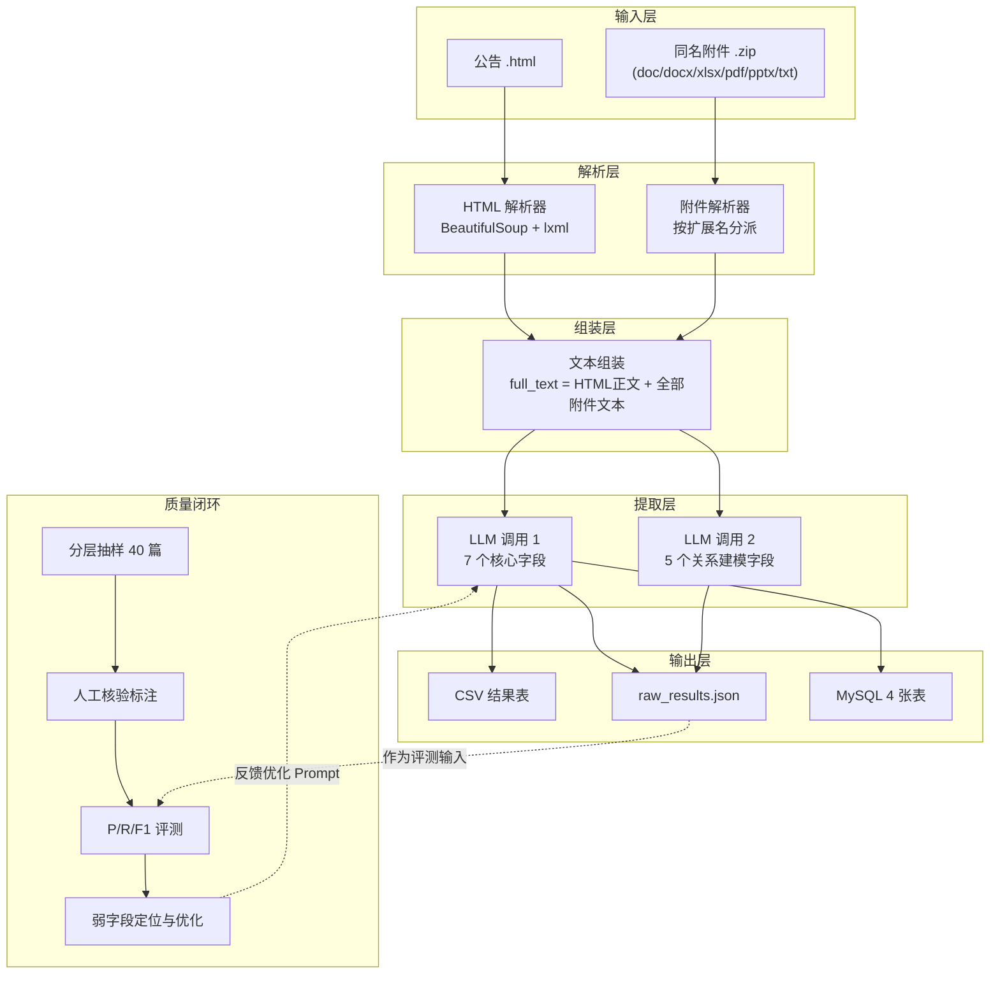

# 任务一 · 实体识别与自动化提取 —— 业务流程说明

> 赛题：面向行业数据的智能实体挖掘与关系建模（赛题五）
> 命题单位：中国软件与技术服务股份有限公司
> 对应赛题章节：五、赛题描述 →（一）任务一

---

## 1. 任务定义与验收口径

### 1.1 赛题原文要求

> **任务说明**：基于赛事提供的招采标讯公告及附件文件，完成标的物关键信息的精准识别与自动化提取，需提取字段包含产品服务名称、品目、品牌（产品供应商）、规格型号、单价、数量、总价等共 **7 个**。
>
> **数据集形式**：招采标讯公告为 html 文件集合；附件以 zip 压缩包提供，**一篇公告对应一个 html 文件和一个附件压缩包（如有）**，内含 doc/docx/xlsx/pdf 等非结构化文本及图片附件。
>
> **任务要求**：优先采用中文实体提取、基于 Transformer 架构的 NLP 技术、Qwen/DeepSeek 系列开源国产大模型的提取方案，可使用轻量化微调、提示工程优化效果，**不建议仅用规则匹配完成核心提取**。

### 1.2 输入与输出

| 项目 | 内容 |
|------|------|
| **输入** | 一篇公告 = 一个 `.html` 文件 + 一个**同名** `.zip` 附件包（无附件时仅有 html） |
| **输出** | 每个**标的物**一条记录，含 7 个核心字段；另附 5 个关系建模字段供任务二使用 |

### 1.3 七个核心字段

| 序号 | 中文字段名 | 内部字段名 | 说明 |
|------|-----------|-----------|------|
| 1 | 产品服务名称 | `product_name` | 采购标的名称，货物/工程/服务三类 |
| 2 | 品目 | `category` | 按政府采购品目分类目录，含品目编码 |
| 3 | 品牌（产品供应商） | `brand` | 产品品牌或生产厂商/授权经销商 |
| 4 | 规格型号 | `spec_model` | 技术参数、型号、配置 |
| 5 | 单价 | `unit_price` | 保留原文数值与单位 |
| 6 | 数量 | `quantity` | 保留原文数值与单位 |
| 7 | 总价 | `total_price` | 该标的物总金额 |

### 1.4 评分项对照（校内赛 40 分 / 决赛 40 分）

| 评分项 | 校内分值 | 决赛分值 | 评分口径 |
|--------|---------|---------|---------|
| 覆盖率 | 10 | 10 | 标的物需覆盖**公告原文**和**附件**两类，各 5 分 |
| 提取率 | 10 | 10 | 7 个关键字段是否全部支持提取 |
| 提取准确性 | 15 | 10 | 准确率×0.4 + 精确率×0.3 + 召回率×0.3，**排名赋分** |
| 处理速率 | 5 | 10 | 总耗时 ÷ 公告总篇数，**排名赋分** |

> 计时口径（赛题第 10 页）：总耗时**从数据集导入完成时刻起算，至全部提取结果写入数据库止**。

---

## 2. 总体业务流程



### 核心入口

| 入口 | 用途 |
|------|------|
| `task1_entity_extraction/main.py` | 命令行批量处理（开发与自测） |
| `task1_entity_extraction/import_to_db.py` | 把已有结果导入 MySQL，不重复调用大模型 |
| `POST /api/upload`（FastAPI） | 平台化的数据集上传与自动处理（任务三） |

---

## 3. 分阶段详述

### 3.1 阶段一：数据装载与配对

**规则**：一篇公告的附件包与 `.html` **同名**。

```
t20260202_26139731.html   ←→   t20260202_26139731.zip
```

**关键实现**：按公告 ID 精确匹配同名 zip，而非扫描目录下所有压缩包。

```python
# pipeline.py → process_single_file()
matching_zip = html_path.parent / f"{announcement_id}.zip"
if matching_zip.exists():
    texts, tables = self.attachment_parser.parse_zip(str(matching_zip), announcement_id)
```

> ⚠️ **历史缺陷记录**：早期版本使用 `glob("*.zip")` 匹配同目录全部压缩包，导致每个公告都要重复解析上千个 zip，实测单篇处理超过 5 分钟。改为同名精确匹配后降至约 0.7 秒/篇。
> 对应赛题"数据质量分析报告"中的**附件解析难点**。

---

### 3.2 阶段二：多格式解析

#### 3.2.1 HTML 解析（`data_loader/html_parser.py`）

| 步骤 | 做法 |
|------|------|
| 解析器 | BeautifulSoup + lxml |
| 正文抽取 | 优先匹配 `.vF_detail_content` / `.TRS_Editor` / `table` 等内容区选择器；政府采购网公告正文多位于 `<table>` 内 |
| 表格抽取 | 遍历全部 `<table>` → `tr` → `td/th`，保留二维结构 |
| 噪声清理 | 剔除 `script` / `style` / `meta` / `link` / `noscript`，压缩多余空白 |

#### 3.2.2 附件解析（`data_loader/attachment_parser.py`）

按扩展名分派，返回 `(文本, 表格)` 二元组：

| 扩展名 | 解析库 | 备注 |
|--------|--------|------|
| `.docx` | python-docx | 段落 + 表格 |
| `.xlsx` / `.xls` | openpyxl / xlrd | 逐 sheet 逐行读取 |
| `.pdf` | pdfplumber | **限制前 15 页、跳过表格提取**（表格提取极慢，收益低） |
| `.pptx` | python-pptx | 文本框 + 表格 |
| `.doc` | 兜底字符解码 | 旧二进制格式无可靠纯 Python 解析器 |
| `.txt` | 多编码尝试 | utf-8 / gbk / gb2312 / latin-1 |

**容错策略**：单个附件解析失败**不中断整体流程**，静默跳过并计入统计。

#### 3.2.3 附件解析实测质量

对 1038 篇公告的 970 个附件包（1943 个附件文件）扫描结果：

| 指标 | 数值 |
|------|------|
| 有同名 zip 的公告 | 970 / 1038（93.4%），另 68 篇本身无附件 |
| **附件可用的公告** | **779 / 1038（75.0%）** |
| 附件文件解析成功 | 1605 / 1943（82.6%） |

按扩展名：

| 扩展名 | 总数 | 成功 | 成功率 |
|--------|------|------|--------|
| `.pdf` | 1785 | 1490 | 83.5% |
| `.docx` | 107 | 65 | 60.7% |
| `.doc` | 50 | 50 | 100% |
| `.xls` | 1 | 0 | 0% |

> ⚠️ **`.doc` 的 100% 成功率具有误导性**：`.doc` 为旧版二进制格式，当前走的是"按字符集解码 + 正则清洗"的兜底方案，
> 只要解出非空文本即计为"成功"，**但抽出的文本可能是乱码或残缺，实际可用性远低于该数字**。
> 该扩展名共 50 个文件（占附件总量 2.6%），影响面有限，但统计口径需在数据质量报告中如实说明。

失败原因分布：

| 次数 | 原因 | 说明 |
|------|------|------|
| 257 | 解析结果为空 | **图片型/扫描版 PDF**，无文字层，需 OCR 才能提取 |
| 43 | PDF 损坏或无有效根对象 | 文件本身损坏 |
| 27 | 非标准 OOXML | 实为旧版 `.doc` 改名，需走兜底解析 |
| 11 | 文件被截断 | 下载不完整 |

> 详细明细见 `output/attachment_coverage_report.json`（由 `analyze_attachments.py` 生成）。

---

### 3.3 阶段三：文本组装

将 HTML 正文与全部附件文本拼接为单一文本块，附件部分带文件名标记以便溯源：

```
full_text = html_text
          + "\n--- 附件：{文件名} ---\n" + 附件文本
          + ...（逐附件追加）
```

实现见 `models/schemas.py` → `AnnouncementContent.full_text` 属性。

---

### 3.4 阶段四：大模型实体提取

**每个公告调用模型两次**（`extractor/llm_extractor.py`）：

| 调用 | 目的 | 输出字段 |
|------|------|---------|
| 调用 1 | 任务一 7 个核心字段 | `entities[]` |
| 调用 2 | 任务二关系建模字段 | `project_name` / `procurement_unit` / `winning_supplier` / `bidders[]` / `project_amount` |

#### 3.4.1 提示工程要点（`extractor/prompts.py`）

系统提示词中明确的约束：

1. 一篇公告可能包含多个标的物，**需全部提取**
2. 字段找不到时**留空字符串**，不得推测编造
3. 金额**保留原文数值与单位**（如 `35,000.00元`）
4. 表格中的信息尤为重要
5. 严格输出 JSON，不含任何其他内容

#### 3.4.2 模型调用参数

| 参数 | 取值 | 说明 |
|------|------|------|
| 模型 | `deepseek-chat`（可切 `qwen-plus`） | 国产开源大模型，符合赛题要求 |
| temperature | 0.1 | 低温度保证输出稳定 |
| max_tokens | 8192 | 防止长表格导致 JSON 被截断 |
| timeout | 120s | — |
| 重试 | 3 次，递增退避 | 应对限流与网络抖动 |

#### 3.4.3 JSON 解析容错（四级降级）

大模型输出可能被 markdown 包裹或中途截断，解析器按四级递进：

```
① 直接 json.loads
② 提取 ```json ... ``` 代码块
③ 截取第一个 { 到最后一个 }
④ 括号配对扫描，抢救被截断响应中所有完整实体对象  ← 关键
```

第 ④ 级 `_salvage_entities()` 通过括号配对（含字符串转义处理）扫描出所有完整 `{...}` 对象。**该机制修复了 17 篇因 `max_tokens` 截断而完全失败的公告**。

---

### 3.5 阶段五：结构化输出与入库

一份数据三个去处：

| 目标 | 文件 / 表 | 用途 |
|------|----------|------|
| CSV | `output/extraction_results.csv` | 提交交付物 |
| JSON | `output/raw_results.json` | 调试与**断点续跑** |
| MySQL | 4 张表 | 平台检索与关系分析 |

**CSV 列结构（13 列）**：

```
公告ID, 产品服务名称, 品目, 品牌（产品供应商）, 规格型号, 单价, 数量, 总价,
project_name, procurement_unit, winning_supplier, bidders, project_amount
```

> 前 8 列为任务一要求的标的物字段；后 5 列为任务二关系建模所需（赛题第 3 页注明"参赛团队可能需要在任务一的数据提取环节增加……额外关键字段"）。

**入库幂等性**：先按 `announcement_id` 删除旧数据，再批量插入，保证重复处理不产生脏数据。

---

### 3.6 阶段六：质量保障闭环

```
分层抽样 40 篇  →  算法标注草稿  →  人工核验（当前进行中）
      ↓
   P/R/F1 评测（同一验证集）
      ↓
   弱字段定位  →  Prompt 优化  →  复测对比
```

**工具链**：

| 脚本 | 作用 |
|------|------|
| `build_validation_set.py` | 分层抽样（按标的物数量分档）→ 可编辑标注 Excel + 原文摘录 |
| `run_evaluation.py` | 读取人工核验后的 Excel → 计算 P/R/F1 → 落盘评测报告 |
| `evaluation/metrics.py` | 评测器：实体对齐 + 逐字段 TP/FP/FN 统计 |

**指标口径定义**：

| 指标 | 计算方式 |
|------|---------|
| TP | 预测值非空 且 标准答案非空 且 两者匹配 |
| FP | 预测值非空但未匹配（值错，或标准答案该处为空） |
| FN | 标准答案非空但未被正确预测 |
| 精确率 | TP / (TP + FP) |
| 召回率 | TP / (TP + FN) |
| 准确率 | TP / (TP + FP + FN) |
| 综合得分 | 准确率×0.4 + 精确率×0.3 + 召回率×0.3 |

**实体对齐机制**：采用**贪心最佳匹配**——先计算预测实体与标准实体的相似度矩阵，再按相似度从高到低两两配对。

> ⚠️ **历史缺陷记录**：初版评测器按**索引顺序**硬比实体，模型输出顺序一变即全盘错配。改为最佳匹配后，漏检实体与多余实体均能正确计入 FN / FP。
> 对应赛题"技术路线对比分析报告"中的**关键尝试与效果数据**。

---

## 4. 关键工程机制

| 机制 | 实现方式 | 解决的问题 |
|------|---------|-----------|
| **并发处理** | ThreadPoolExecutor，8 线程 | 提升吞吐，实测约 1.4 篇/秒 |
| **失败重试** | 3 次 + 递增退避（2s / 4s / 6s） | 应对 API 限流与网络抖动 |
| **JSON 容错** | 四级降级 + 括号配对抢救 | 应对响应截断与格式污染 |
| **断点续跑** | `--resume` 读取历史成功结果并跳过 | 避免重复消耗 API 额度 |
| **入库幂等** | 先删后插 | 重跑不产生重复记录 |
| **数据库降级** | 连接失败仅告警，继续输出文件 | 保证核心提取不被环境问题阻塞 |
| **并发写入加锁** | `threading.Lock` 串行化数据库写入 | pymysql 连接非线程安全 |
| **文件配对防呆** | 同名 zip 精确匹配 | 避免全目录扫描的性能灾难 |

---

## 5. 数据模型

### 5.1 表结构（`database/schema.py`）

| 表名 | 作用 | 关键字段 |
|------|------|---------|
| `announcements` | 公告元数据 | `announcement_id`(唯一), `raw_text`, `status`, `error_message` |
| `extracted_entities` | **任务一核心**：标的物 7 字段 | `announcement_id`, 7 个字段 |
| `project_relations` | 任务二：项目关系 | `procurement_unit`, `winning_supplier`, `project_amount` |
| `bidders` | 任务二：竞标主体 | `bidder_name`, `is_winner` |

### 5.2 字段长度设计依据

按实际数据统计最大值设定，避免写入时报 `Data too long`：

| 字段 | 实际最大值 | 设定长度 |
|------|-----------|---------|
| `spec_model` | 1411 字符 | VARCHAR(2048) |
| `project_amount` | 458 字符 | VARCHAR(1024) |
| `winning_supplier` | 242 字符 | VARCHAR(512) |
| `brand` | 158 字符 | VARCHAR(255) |

---

## 6. 服务化接口

任务一相关接口（FastAPI，`api/routers/task1.py`）：

| 方法 | 路径 | 说明 |
|------|------|------|
| GET | `/api/health` | 健康检查 + 数据总量 |
| GET | `/api/entities` | 标的物检索（关键词 / 字段筛选 / 分页） |
| GET | `/api/entities/{announcement_id}` | 某篇公告的全部标的物 |
| GET | `/api/stats` | 7 个字段填充率统计 |
| POST | `/api/upload` | 数据集上传与自动处理（任务三） |
| GET | `/api/tasks/{task_id}` | 上传任务进度轮询 |

**安全措施**：字段筛选参数经**白名单校验**后才拼入 SQL，防止注入。

---

## 7. 运行与复现

```bash
# 1) 数据库（MySQL 8.0.26，免安装部署于 3306）
D:\project\mysql-server\mysql-8.0.26\bin\mysqld.exe --defaults-file=D:\project\mysql-server\my.ini

# 2) 批量提取（命令行）
cd task1_entity_extraction
python main.py --input ../benchmark_data/combined --format csv --output extraction_results

# 3) 断点续跑（跳过已成功的公告）
python main.py --input ../benchmark_data/combined --resume

# 4) 已有结果导入数据库（不调用大模型）
python import_to_db.py ../benchmark_data/combined

# 5) 附件覆盖率分析
python analyze_attachments.py ../benchmark_data/combined

# 6) 验证集与评测
python build_validation_set.py ../benchmark_data/combined 40
python run_evaluation.py

# 7) 启动后端服务
python run_server.py --reload
```

---

## 8. 当前实测数据

### 8.1 提取结果

| 指标 | 数值 |
|------|------|
| 公告处理成功率 | **1038 / 1038（100%）** |
| 提取标的物总数 | **6856 条** |
| 处理总耗时 | 约 12 分钟（8 线程） |
| 平均处理速度 | 约 1.4 篇/秒 |

### 8.2 七个核心字段填充率

| 字段 | 非空条数 | 填充率 | 评价 |
|------|---------|--------|------|
| 产品服务名称 | 6856 | 100.0% | 优秀 |
| 品牌（产品供应商） | 6678 | 97.4% | 优秀 |
| 品目 | 6506 | 94.9% | 良好 |
| 数量 | 6164 | 89.9% | 良好 |
| 规格型号 | 5867 | 85.6% | 良好 |
| 总价 | 5839 | 85.2% | 良好 |
| **单价** | 5229 | **76.3%** | **待优化** |

### 8.3 入库统计

| 表 | 行数 |
|----|------|
| `announcements` | 1038 |
| `extracted_entities` | 6856 |
| `project_relations` | 1027 |
| `bidders` | 3621 |

---

## 9. 已知缺口与后续计划

| 项 | 状态 | 计划 |
|----|------|------|
| 覆盖率：公告原文一档 | ✅ 100%，预计得 5 分 | — |
| 覆盖率：附件一档 | ⚠️ 75%，主要受限于图片型扫描 PDF | 引入 OCR 补齐 |
| 提取率：7 字段支持 | ✅ 已全部支持 | — |
| 提取准确性 | ⏳ **无数据** | 完成 40 篇验证集人工核验 → 跑出真实 P/R/F1 基线 |
| 处理速率 | ⏳ 未按赛题口径正式计时 | 按"导入完成 → 结果写入数据库"口径计时 |
| 弱字段优化 | ⏳ 待基线确定 | 针对单价（76.3%）分析失败原因并优化 Prompt |
| 技术路线对比 | ⏳ 未产出 | 对比"提示工程 vs LoRA 微调"（赛题要求至少 2 种方案） |

### 已知代码缺陷

**Prompt 路由错配**（`extractor/prompts.py` → `build_extraction_prompt`）：

```python
if has_tables:
    return SYSTEM_PROMPT, TABLE_PROMPT_TEMPLATE.format(table_text=text)
```

当公告含表格时会选用"表格专用模板"，该模板告知模型"以下是表格内容（每行用 | 分隔）"，但实际传入的是 `content.full_text`（HTML 正文 + 全部附件的完整文本）。由于公告正文几乎都位于 `<table>` 中，**绝大多数公告都走了这个错配分支**。

修复方式简单，但会改变模型输出，需在基线确定后重新跑一轮提取以量化改造前后差异——该数据正好可作为"技术路线对比分析报告"的素材。

---

## 附录：代码目录结构

```
task1_entity_extraction/
├── main.py                     # 命令行入口
├── run_server.py               # FastAPI 服务启动入口
├── pipeline.py                 # 主流程编排（并发 + 进度回调）
├── config.py                   # 全局配置
├── import_to_db.py             # 结果导入数据库
├── analyze_attachments.py      # 附件覆盖率与质量分析
├── probe_empty_pdf.py          # 空文本 PDF 探测（OCR 必要性论证）
├── build_validation_set.py     # 验证集构建（分层抽样）
├── run_evaluation.py           # 评测执行
├── data_loader/
│   ├── html_parser.py          # HTML 公告解析
│   └── attachment_parser.py    # 多格式附件解析
├── extractor/
│   ├── llm_extractor.py        # 大模型提取器（重试 + JSON 容错）
│   └── prompts.py              # 提示工程模板
├── models/schemas.py           # 数据模型定义
├── database/
│   ├── connection.py           # 连接管理
│   ├── schema.py               # 表结构 DDL
│   └── dao.py                  # 数据访问层
├── evaluation/metrics.py       # 评测器（实体对齐 + P/R/F1）
├── output/writer.py            # 结果输出
├── api/                        # 任务三平台后端
│   ├── main.py                 # FastAPI 应用 + CORS
│   ├── deps.py                 # 请求级数据库依赖
│   ├── services/task_manager.py# 上传任务状态管理
│   └── routers/
│       ├── task1.py            # 任务一接口
│       └── task3.py            # 任务三上传接口
└── frontend/                   # Vue 3 可视化平台前端
```